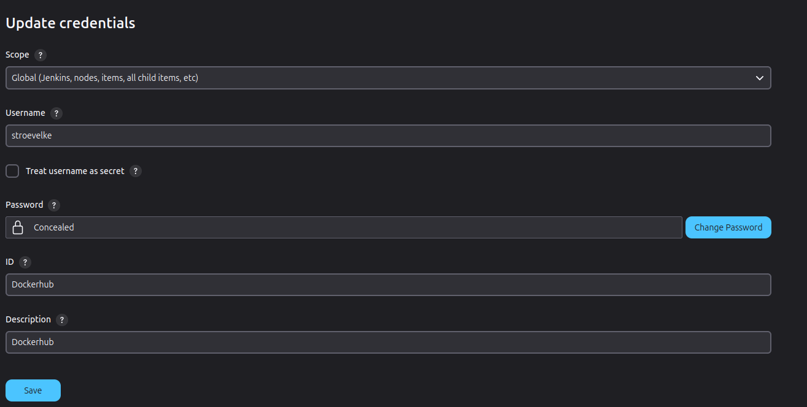

Vul onderstaande aan met de antwoorden op de vragen uit de readme.md file. Wil je de oplossingen file van opmaak voorzien? Gebruik dan [deze link](https://github.com/adam-p/markdown-here/wiki/Markdown-Cheatsheet) om informatie te krijgen over
opmaak met Markdown.

a)
To give Jenkins the rights to run docker commands without using sudo, we had to do this:
sudo usermod -aG docker jenkins

sudo su - jenkins

This added jenkins to the docker group

We added our Dockerhub credentials so we can use them in the pipeline.

b)
